# NXP Application Code Hub
[](https://www.nxp.com)

## FRDM-RW612 Matter standalone temperature measurement with on-board sensor

This demo shows how to modify matter examples to add a desired functionality, in this case adding support for the P3T1755 sensor on the FRDM-RW612 board

#### Boards: FRDM-RW612
#### Categories: Tools, Sensor, Wireless Connectivity
#### Peripherals: Wi-Fi, 802.15.4, SENSOR, UART
#### Toolchains: VS Code

## Table of Contents
1. [Software](#step1)
2. [Hardware](#step2)
3. [Setup](#step3)
4. [Results](#step4)
5. [FAQs](#step5) 
6. [Support](#step6)
7. [Release Notes](#step7)

## 1. Software<a name="step1"></a>

* [Visual Studio Code with MCUXpresso Plugin](https://marketplace.visualstudio.com/items?itemName=NXPSemiconductors.mcuxpresso)
* [NXP Matter Repo V1.4.2.0 or above](https://github.com/NXP/matter/releases/tag/v1.4.2.0.1)
* [Demo Source files](common/main/)
* [NXP Matter Chip-tool mobile app](https://play.google.com/store/apps/details?id=com.verik.mattercontrol&hl=en-US&pli=1)

## 2. Hardware<a name="step2"></a>

### FRDM RW612 Board

<p align="center">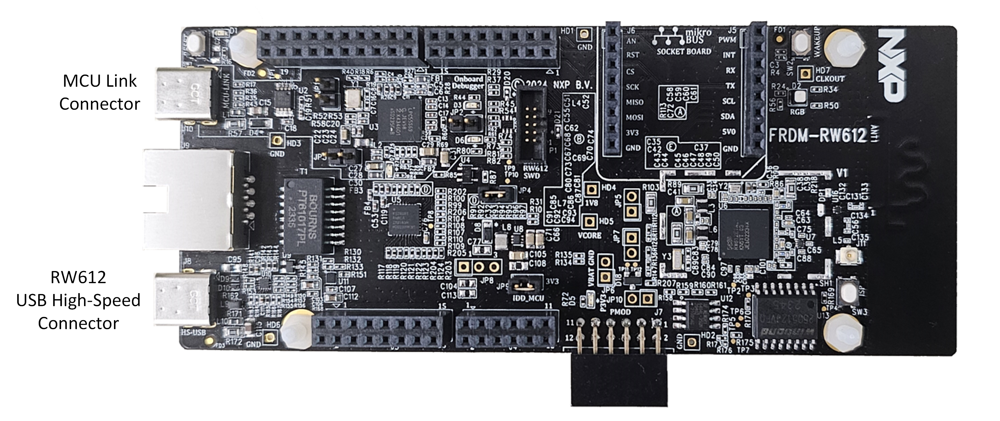

### UART to USB connector (optional)

in this example we use MCU Link:

[<p align="center">](https://www.nxp.com/design/design-center/software/development-software/mcuxpresso-software-and-tools-/mcu-link-debug-probe:MCU-LINK)

### SmartPhone with the NXP Matter Chip-tool mobile app

<p align="center">

## 3. Setup<a name="step3"></a>

### Get NXP Matter Repo

On Visual Studio Code go to the MCUXpresso plugin extension, open the MCUXpresso installer and make sure you have at least the following installed: Matter Developer, Arm GNU Toolchain, LinkServer

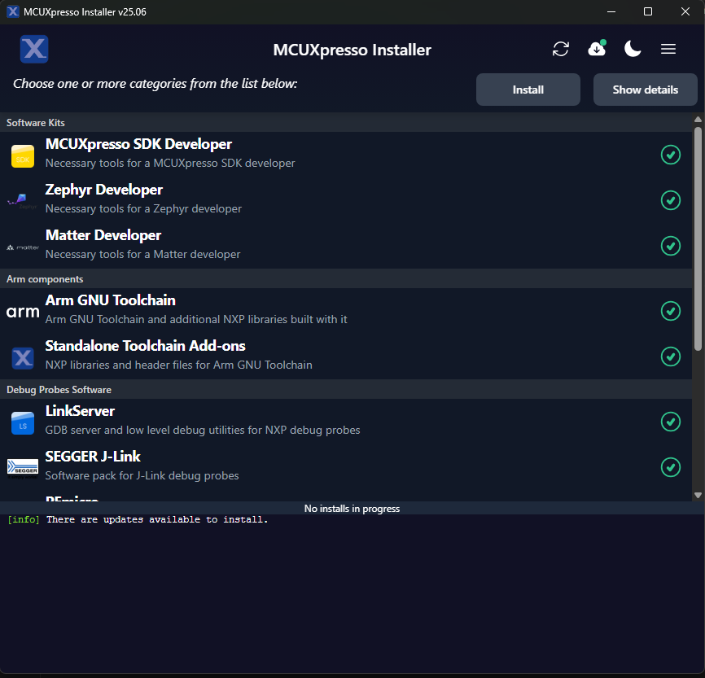

On the MCUXpresso plugin extension, go to the "Imported Repositories" and click on the plus sign to import a repository:

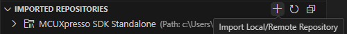

On repository select NXP Matter or manually input the GitHub link (https://github.com/NXP/matter) select the latest revision and a location to clone, make sure it's as close to c:\ as possible to avoid long path issues and avoid using spaces in the name of the folder:

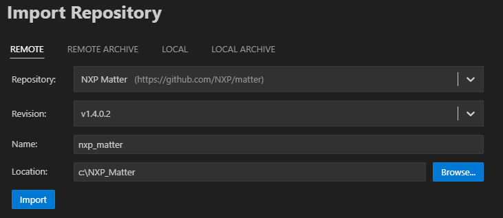

This will take a while.

### Modifying Matter examples

#### "Standalone" or repository app

Currently there is no direct support for creating Standalone applications, by default when importing a demo application it is linked to the repo, so any changes made on the files will change the example from the repository. To avoid this you can manually make a copy of the nxp folder that contains the needed project files.

To do this go to the location where you cloned the Matter repo and find the example you want to modify in the following path:

    C:/nxp_matter_v1_4_0_2/examples/

in that same path create a folder to put your custom example

    C:/nxp_matter_v1_4_0_2/examples/My_app

Copy the folders inside of the top folder into your newly created folder:

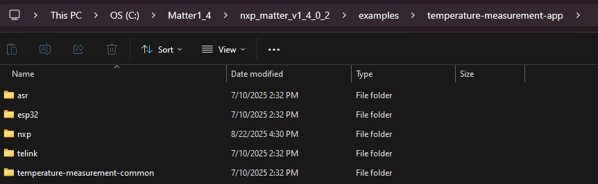

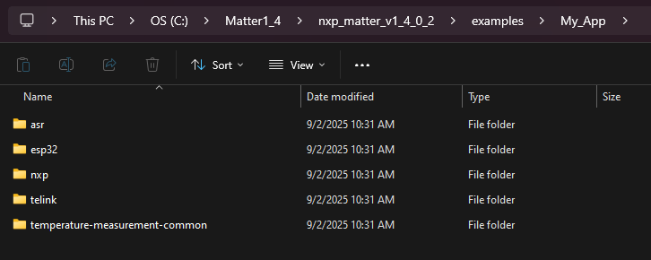

Now right click the nxp folder and open the folder on VS Code, this will load the project into MCUXpresso for VS Code, and now you have a copy on which you can modify the top common files independently.

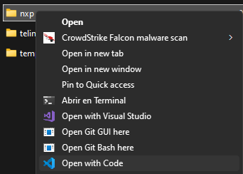

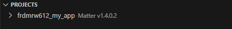

#### Changing the code

There are two possible approaches to modify a Matter example, the first one is to import any example and use the ZAP tool to modify the endpoints and the device types, and the second which is covered here is to look for an existing example that implements the device type we are looking for and modify it to add the needed functionality.

In this case the temperature measurement app works since it implements a Matter temperature sensor. If you don't want to make a copy, you can import the project from the repo. Go to the "Projects" tab and click on "Import Example from Repository":

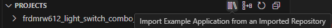

Import the desired example in this case the "temperature_measurement_app"

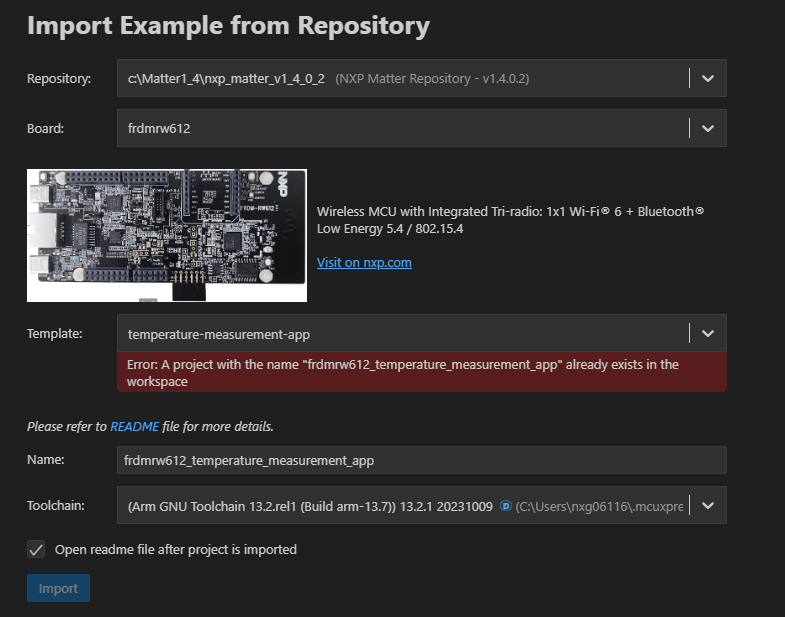

In this case the modified source files for the example to work are provided here in the repo, the important files are prj.conf, AppTask.cpp/h, and TemperatureSensorManager.cpp/h. You can find the files that need to be replaced on the projects tab by clicking the drop down arrow on the desired project:

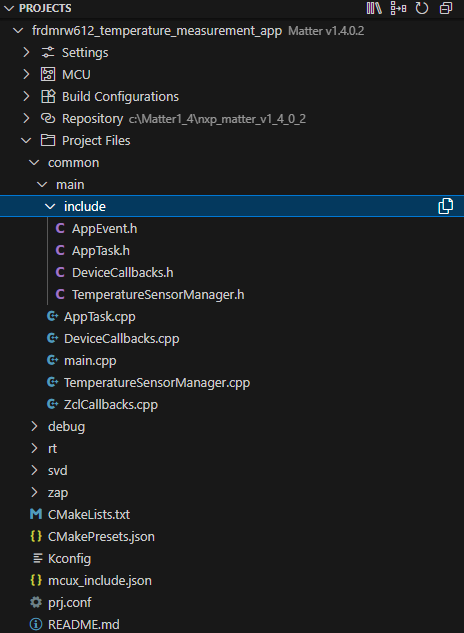

The next section explains the modifications.

### Explaining the changes
This section explains the changes made to get the example to use the on board temperature sensor but a similar process can be used to modify any example.
#### Adding drivers or source files
NXP Matter examples are linked to the GitHub SDK, which means all of the SDK files and drivers are there but they might not be included by default on your project, you can add drivers using the .conf configuration file. When you build the project, a new folder named "debug" will appear with all the built files, there you will find a file named ".config" where you can see all of the available configurations, like which drivers are already enabled.
In this case the only change was to add the driver for the temperature sensor from the SDK:

```conf
    CONFIG_MCUX_COMPONENT_driver.p3t1755=y
```

If you want to add your own source files for your drivers or custom functions, you should add them on the common/main for .c/.cpp and common/main/include for .h, then on CMakeLists.txt add the files on target_sources as shown there:

```cmake
target_sources(app
    PRIVATE
    ${NXP_EXAMPLE_DIR}/main/main.cpp
    ${NXP_EXAMPLE_DIR}/main/AppTask.cpp
    ${NXP_EXAMPLE_DIR}/main/DeviceCallbacks.cpp
    ${NXP_EXAMPLE_DIR}/main/ZclCallbacks.cpp
    ${NXP_EXAMPLE_DIR}/main/MyCustomFile.cpp
    ${ALL_CLUSTERS_COMMON_DIR}/src/binding-handler.cpp
)
```

Now you can #include these files.

#### Modifying TemperatureSensorManager.cpp

This file implements a fake temperature sensor. In order to add the real sensor, we need to add the code for it to work.
For that first include the needed files to setup the sensor:

```cpp
#include "fsl_p3t1755.h"
#include "fsl_i2c.h"
#include "RW612.h"
#include "pin_mux.h"
#include "fsl_common.h"
#include "fsl_io_mux.h"
```

The sensor works with I2C so in this case we need to add the I2C Initializations and the P3T1755 sensor initializations, the example already provides a function to add this:

```cpp
CHIP_ERROR TemperatureSensorManager::Init()
{
    Init functions...
}
```

See the modified "TemperatureSensorManager.cpp" file inside this repo to look at how the I2C code and PT31755 initializations were made and what changes are needed on the original file of the NXP Matter repository example.

Next we implement a function to send the read command to the sensor:

```cpp
void TemperatureSensorManager::TemperatureRead()
{
    status_t result = kStatus_Success;
 
    result = P3T1755_ReadTemperature(&p3t1755Handle, &temperature);
    if (result != kStatus_Success)
    {
        ChipLogProgress(DeviceLayer, "\r\nP3T1755 read temperature failed.\r\n");
    }
}
```

The original example sends the fake sensor read each time the "temperature" CLI command was issued on the serial terminal, but in this case we want the temperature read to be periodic, so we will use this function to a make the asynchronous read and then use GetMeasuredValue() to return the value when the I2C transfer is completed.

Don’t forget to add the new function definitions on the corresponding .h file

#### Modifying AppTask.cpp

In AppTask.cpp we only need two changes, creating the task for the periodic read and the task function:

```cpp
void TemperatureSensorApp::AppTask::Temp_Sensor_Periodic_Read(void *arg)
{

    xTempSensorTaskHandle = xTaskGetCurrentTaskHandle(); // Register this task for notification

    int16_t temperature = 0;
    while(1)
    {
        TemperatureSensorMgr().TemperatureRead();
        
        // Wait for notification from ISR (with timeout)
        ulTaskNotifyTake(pdTRUE, pdMS_TO_TICKS(5000)); // Wait up to 5000ms

        temperature = TemperatureSensorMgr().GetMeasuredValue();
        ChipLogProgress(DeviceLayer, "######## TemperatureMeasurement::Set : %d", temperature);
        app::Clusters::TemperatureMeasurement::Attributes::MeasuredValue::Set(1, temperature);
        vTaskDelay(pdMS_TO_TICKS(5000)); // Delay between reads
    }
}
```

and then in PostInitMatterStack() create the task with a low priority:

```cpp
void TemperatureSensorApp::AppTask::PostInitMatterStack()
{
    CHIP_ERROR err = CHIP_NO_ERROR;
    chip::app::InteractionModelEngine::GetInstance()->RegisterReadHandlerAppCallback(&chip::NXP::App::GetICDUtil());
    if (TemperatureSensorMgr().Init() != CHIP_NO_ERROR)
    {
        ChipLogError(DeviceLayer, "Init TemperatureSensorMgr failed: %s", ErrorStr(err));
    }
    xTaskCreate(Temp_Sensor_Periodic_Read, "temperature_sensor_task", configMINIMAL_STACK_SIZE * 2, NULL, 0 , NULL);
}
```

This way you managed to add new functionality modifying only the common files of the example.

## 4. Results<a name="step4"></a>

###  How to test the demo

#### Hardware

Connect your board to your computer via the MCU-Link and if you want the logs you can use a serial to USB converter connected to the FC0_UART on the Mikro e header:

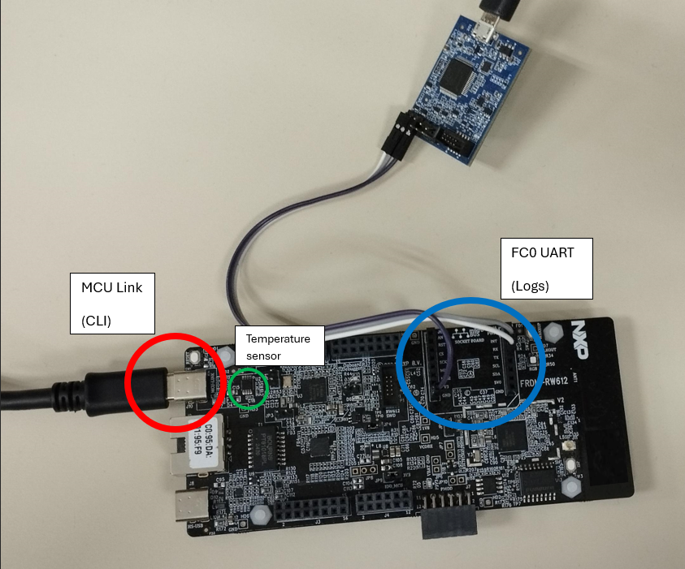

#### Software

In order to test the demo, right click on the proyect, click on Pristine Build/Rebuild Project to build with all the new changes, then flash the code in to your board.

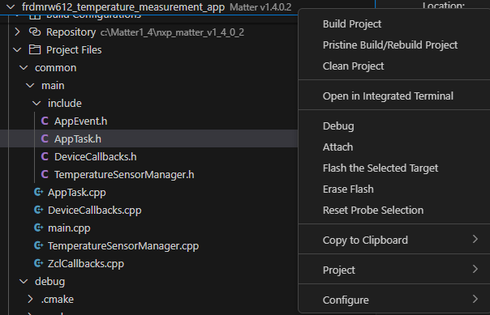

You can connect a serial to USB device on FC0_UART to your computer and open the COM Port on a serial terminal to look at the debug messages as well as the notifications of temperature changes being printed there.

To do the full test you can use an Alexa or Google home device to pair the board and see the measurements, or you can use the NXP Matter Tool app for mobile devices.

To get the QR code to pair the device open a serial port for the FRDM-RW612 board and use the CLI and the command: onboardingcodes ble qrcodeurl. This will give you a link that shows the QR code needed to pair the device.

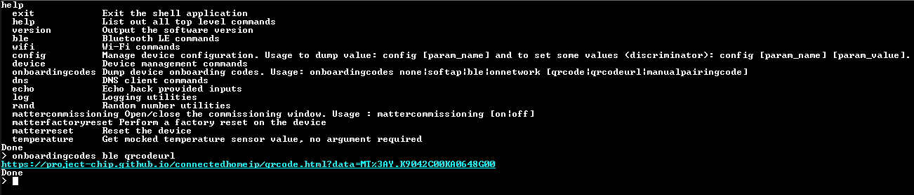

If BLE advertisement is not working use the following command to ensure it is running:
```
ble adv start
```

The FC0_UART console should look like this:

<p align="center">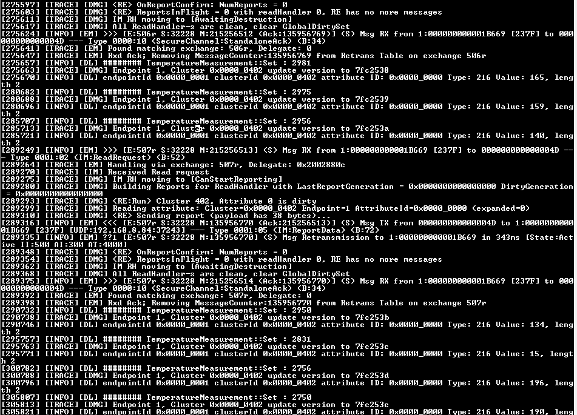


And on your connected mobile device you should see the temperature value:

<p align="center">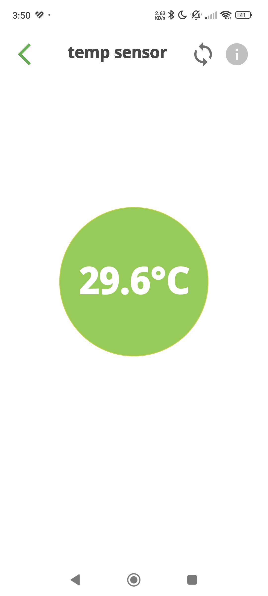

You can tap the refresh arrows icon at the top right to refresh the sensor value.

## 5. FAQs<a name="step5"></a>

No FAQs have been identified for this project.

## 6. Support<a name="step6"></a>


#### Project Metadata

<!----- Boards ----->
[]()

<!----- Categories ----->
[](https://mcuxpresso.nxp.com/appcodehub?category=tools)
[](https://mcuxpresso.nxp.com/appcodehub?category=sensor)
[](https://mcuxpresso.nxp.com/appcodehub?category=wireless_connectivity)

<!----- Peripherals ----->
[](https://mcuxpresso.nxp.com/appcodehub?peripheral=wifi)
[](https://mcuxpresso.nxp.com/appcodehub?peripheral=802154)
[](https://mcuxpresso.nxp.com/appcodehub?peripheral=sensor)
[](https://mcuxpresso.nxp.com/appcodehub?peripheral=uart)

<!----- Toolchains ----->
[](https://mcuxpresso.nxp.com/appcodehub?toolchain=vscode)

Questions regarding the content/correctness of this example can be entered as Issues within this GitHub repository.

>**Warning**: For more general technical questions regarding NXP Microcontrollers and the difference in expected functionality, enter your questions on the [NXP Community Forum](https://community.nxp.com/)

[](https://www.youtube.com/NXP_Semiconductors)
[](https://www.linkedin.com/company/nxp-semiconductors)
[](https://www.facebook.com/nxpsemi/)
[](https://x.com/NXP)

## 7. Release Notes<a name="step7"></a>
| Version | Description / Update                           | Date                        |
|:-------:|------------------------------------------------|----------------------------:|
| 1.0     | Initial release on Application Code Hub        | May 8<sup>th</sup> 2026 |

<small>
<b>Trademarks and Service Marks</b>: There are a number of proprietary logos, service marks, trademarks, slogans and product designations ("Marks") found on this Site. By making the Marks available on this Site, NXP is not granting you a license to use them in any fashion. Access to this Site does not confer upon you any license to the Marks under any of NXP or any third party's intellectual property rights. While NXP encourages others to link to our URL, no NXP trademark or service mark may be used as a hyperlink without NXP’s prior written permission. The following Marks are the property of NXP. This list is not comprehensive; the absence of a Mark from the list does not constitute a waiver of intellectual property rights established by NXP in a Mark.
</small>
<br>
<small>
NXP, the NXP logo, NXP SECURE CONNECTIONS FOR A SMARTER WORLD, Airfast, Altivec, ByLink, CodeWarrior, ColdFire, ColdFire+, CoolFlux, CoolFlux DSP, DESFire, EdgeLock, EdgeScale, EdgeVerse, elQ, Embrace, Freescale, GreenChip, HITAG, ICODE and I-CODE, Immersiv3D, I2C-bus logo , JCOP, Kinetis, Layerscape, MagniV, Mantis, MCCI, MIFARE, MIFARE Classic, MIFARE FleX, MIFARE4Mobile, MIFARE Plus, MIFARE Ultralight, MiGLO, MOBILEGT, NTAG, PEG, Plus X, POR, PowerQUICC, Processor Expert, QorIQ, QorIQ Qonverge, RoadLink wordmark and logo, SafeAssure, SafeAssure logo , SmartLX, SmartMX, StarCore, Symphony, Tower, TriMedia, Trimension, UCODE, VortiQa, Vybrid are trademarks of NXP B.V. All other product or service names are the property of their respective owners. © 2021 NXP B.V.
</small>
